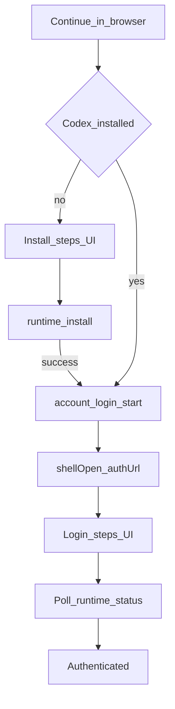

# Codex Install-Then-Browser-Login Flow Implementation Plan

**Status:** SUPERSEDED as the ChatGPT login path by [2026-09-17 Single-Provider Runtime Design](../specs/2026-09-17-single-provider-runtime-design.md). ChatGPT Official no longer installs Codex CLI.

> **For agentic workers:** REQUIRED SUB-SKILL: Use superpowers:subagent-driven-development (recommended) or superpowers:executing-plans to implement this plan task-by-task. Steps use checkbox (`- [ ]`) syntax for tracking.

**Goal:** When Codex CLI is missing, Accounts → Codex still offers “Continue in browser”: auto-install Codex, show Claude-style step progress, open the ChatGPT auth URL, then wait until authenticated.

**Architecture:** Keep Codex auth owned by local `codex app-server` (no zero-CLI OAuth). Extend `runtime-store` with a Codex setup-flow state machine (`installing` → `logging-in` → `complete`/`error`), drive install steps from existing `runtime-install-output` / `runtime-install-complete` events, and chain `install("codex")` → `startLogin("codex", mode)` with auto `shellOpen(authUrl)`. Reuse a small shared `StepRow` UI extracted from the Claude setup pattern.

**Tech Stack:** React 19, TypeScript, Zustand, Vitest, Tauri 2 events (`runtime-install-*`), existing `runtimeInstall` / `runtimeLoginStart` commands.

---

## Constraint (do not violate)

- Codex ChatGPT login **requires** a local Codex binary. This plan never invents a pure web OAuth path.
- Do not bundle a Codex sidecar; continue using `runtime_install` (npm / winget) from [`apps/desktop/src-tauri/src/runtime/codex/mod.rs`](apps/desktop/src-tauri/src/runtime/codex/mod.rs).
- Claude’s `ClaudeSetup` flow stays unchanged; only share a tiny presentational step helper.

## File map

**Create**

- `apps/desktop/src/lib/runtime-flow-steps.ts` — `StepInfo`, `advanceSteps`, Codex install/login step constants.
- `apps/desktop/src/components/runtime/runtime-flow-steps.tsx` — `RuntimeFlowStepRow` presentational list.
- `apps/desktop/src/__tests__/lib/runtime-flow-steps.test.ts` — step helper unit tests.
- `apps/desktop/src/__tests__/stores/codex-setup-flow.test.ts` — install-then-login store orchestration tests.

**Modify**

- `apps/desktop/src/runtime/types.ts` — add install-event payload types + `CodexSetupFlowState`.
- `apps/desktop/src/stores/runtime-store.ts` — flow state, event listeners, `ensureInstalledAndStartLogin`.
- `apps/desktop/src/components/runtime/runtime-card.tsx` — not-installed CTA + step UI + auto-open browser.
- `apps/desktop/src/components/runtime/runtime-settings.tsx` — wire new store action / flow props.
- `apps/desktop/src/__tests__/components/runtime-card.test.tsx` — not-installed browser CTA + steps.
- `apps/desktop/src/__tests__/components/runtime-settings.test.tsx` — ensure wiring for new action.
- `apps/desktop/src/__tests__/stores/runtime-store.test.ts` — keep existing login tests green; add thin smoke if needed.



---

### Task 1: Shared step helpers

**Files:**
- Create: `apps/desktop/src/lib/runtime-flow-steps.ts`
- Test: `apps/desktop/src/__tests__/lib/runtime-flow-steps.test.ts`

- [ ] **Step 1: Write the failing test**

```ts
// apps/desktop/src/__tests__/lib/runtime-flow-steps.test.ts
import { describe, expect, it } from "vitest";
import {
  advanceSteps,
  CODEX_INSTALL_STEPS,
  CODEX_LOGIN_STEPS,
  STEP_ORDER_CODEX_INSTALL,
  createPendingSteps,
} from "@/lib/runtime-flow-steps";

describe("runtime-flow-steps", () => {
  it("creates pending copies of Codex install/login steps", () => {
    const install = createPendingSteps(CODEX_INSTALL_STEPS);
    expect(install.map((s) => s.id)).toEqual(STEP_ORDER_CODEX_INSTALL);
    expect(install.every((s) => s.status === "pending")).toBe(true);
    expect(createPendingSteps(CODEX_LOGIN_STEPS)[0]?.id).toBe("opening-browser");
  });

  it("marks prior steps complete when advancing", () => {
    const steps = createPendingSteps(CODEX_INSTALL_STEPS);
    const next = advanceSteps(steps, "verifying", STEP_ORDER_CODEX_INSTALL);
    expect(next.find((s) => s.id === "downloading")?.status).toBe("complete");
    expect(next.find((s) => s.id === "installing")?.status).toBe("complete");
    expect(next.find((s) => s.id === "verifying")?.status).toBe("active");
    expect(next.find((s) => s.id === "complete")?.status).toBe("pending");
  });
});
```

- [ ] **Step 2: Run test to verify it fails**

Run: `cd apps/desktop && pnpm exec vitest run src/__tests__/lib/runtime-flow-steps.test.ts`

Expected: FAIL — module `@/lib/runtime-flow-steps` not found.

- [ ] **Step 3: Write minimal implementation**

```ts
// apps/desktop/src/lib/runtime-flow-steps.ts
export type StepStatus = "pending" | "active" | "complete" | "error";

export interface StepInfo {
  id: string;
  label: string;
  status: StepStatus;
}

export const CODEX_INSTALL_STEPS: Omit<StepInfo, "status">[] = [
  { id: "downloading", label: "Downloading Codex" },
  { id: "installing", label: "Installing CLI" },
  { id: "verifying", label: "Verifying installation" },
  { id: "complete", label: "Codex ready" },
];

export const CODEX_LOGIN_STEPS: Omit<StepInfo, "status">[] = [
  { id: "opening-browser", label: "Opening browser" },
  { id: "waiting-auth", label: "Waiting for ChatGPT sign-in" },
  { id: "complete", label: "Authenticated" },
];

export const STEP_ORDER_CODEX_INSTALL = CODEX_INSTALL_STEPS.map((s) => s.id);
export const STEP_ORDER_CODEX_LOGIN = CODEX_LOGIN_STEPS.map((s) => s.id);

export function createPendingSteps(
  defs: Omit<StepInfo, "status">[],
): StepInfo[] {
  return defs.map((step) => ({ ...step, status: "pending" as const }));
}

export function advanceSteps(
  steps: StepInfo[],
  targetId: string,
  order: string[],
): StepInfo[] {
  const targetIdx = order.indexOf(targetId);
  return steps.map((step) => {
    const thisIdx = order.indexOf(step.id);
    if (thisIdx < targetIdx && step.status !== "error") {
      return { ...step, status: "complete" as const };
    }
    if (step.id === targetId) {
      return { ...step, status: "active" as const };
    }
    return step;
  });
}

export function failActiveStep(steps: StepInfo[], errorLabel?: string): StepInfo[] {
  return steps.map((step) =>
    step.status === "active"
      ? {
          ...step,
          status: "error" as const,
          label: errorLabel ? `${step.label}: ${errorLabel}` : step.label,
        }
      : step,
  );
}

export function completeAllSteps(steps: StepInfo[]): StepInfo[] {
  return steps.map((step) =>
    step.status === "error" ? step : { ...step, status: "complete" as const },
  );
}
```

- [ ] **Step 4: Run test to verify it passes**

Run: `cd apps/desktop && pnpm exec vitest run src/__tests__/lib/runtime-flow-steps.test.ts`

Expected: PASS.

- [ ] **Step 5: Commit**

```bash
git add apps/desktop/src/lib/runtime-flow-steps.ts apps/desktop/src/__tests__/lib/runtime-flow-steps.test.ts
git commit -m "$(cat <<'EOF'
feat(runtime): add shared Codex install/login step helpers

EOF
)"
```

---

### Task 2: Presentational step list component

**Files:**
- Create: `apps/desktop/src/components/runtime/runtime-flow-steps.tsx`
- Test: extend `apps/desktop/src/__tests__/components/runtime-card.test.tsx` in Task 5 (component is dumb; covered via card).

- [ ] **Step 1: Implement `RuntimeFlowStepRow`**

```tsx
// apps/desktop/src/components/runtime/runtime-flow-steps.tsx
import {
  AlertCircleIcon,
  CheckIcon,
  CircleIcon,
  LoaderIcon,
} from "lucide-react";
import { cn } from "@/lib/utils";
import type { StepInfo } from "@/lib/runtime-flow-steps";

export function RuntimeFlowSteps({ steps }: { steps: StepInfo[] }) {
  if (steps.length === 0) return null;
  return (
    <div className="space-y-0.5 rounded-md border border-border/60 bg-muted/20 px-3 py-2">
      {steps.map((step) => (
        <RuntimeFlowStepRow key={step.id} step={step} />
      ))}
    </div>
  );
}

function RuntimeFlowStepRow({ step }: { step: StepInfo }) {
  return (
    <div className="flex items-center gap-2.5 py-1">
      {step.status === "complete" && (
        <CheckIcon className="size-3.5 text-green-600" />
      )}
      {step.status === "active" && (
        <LoaderIcon className="size-3.5 animate-spin text-foreground" />
      )}
      {step.status === "pending" && (
        <CircleIcon className="size-3.5 text-muted-foreground/30" />
      )}
      {step.status === "error" && (
        <AlertCircleIcon className="size-3.5 text-destructive" />
      )}
      <span
        className={cn(
          "text-sm",
          step.status === "complete" && "text-green-600",
          step.status === "active" && "font-medium text-foreground",
          step.status === "pending" && "text-muted-foreground/60",
          step.status === "error" && "text-destructive",
        )}
      >
        {step.label}
      </span>
    </div>
  );
}
```

- [ ] **Step 2: Commit**

```bash
git add apps/desktop/src/components/runtime/runtime-flow-steps.tsx
git commit -m "$(cat <<'EOF'
feat(runtime): add RuntimeFlowSteps presentational list

EOF
)"
```

---

### Task 3: Types for install events + Codex setup flow

**Files:**
- Modify: `apps/desktop/src/runtime/types.ts`

- [ ] **Step 1: Append types** (keep existing `RuntimeLoginState` intact)

```ts
import type { StepInfo } from "@/lib/runtime-flow-steps";

export type RuntimeInstallOutputEvent = {
  runtime: RuntimeKind;
  stream: "stdout" | "stderr" | "status";
  line: string;
};

export type RuntimeInstallCompleteEvent = {
  runtime: RuntimeKind;
  success: boolean;
};

export type CodexSetupFlowPhase =
  | "idle"
  | "installing"
  | "logging-in"
  | "complete"
  | "error";

export type CodexSetupFlowState = {
  phase: CodexSetupFlowPhase;
  installSteps: StepInfo[];
  loginSteps: StepInfo[];
  installLogs: string[];
  error: string | null;
  /** When true, browser login should auto-open authUrl once. */
  autoOpenBrowser: boolean;
};
```

Also export a factory near the types file consumer (store) — not required in types.ts.

- [ ] **Step 2: Commit**

```bash
git add apps/desktop/src/runtime/types.ts
git commit -m "$(cat <<'EOF'
feat(runtime): add Codex setup flow and install event types

EOF
)"
```

---

### Task 4: Store — install-then-login orchestration (TDD)

**Files:**
- Modify: `apps/desktop/src/stores/runtime-store.ts`
- Test: `apps/desktop/src/__tests__/stores/codex-setup-flow.test.ts`

- [ ] **Step 1: Write failing store tests**

```ts
// apps/desktop/src/__tests__/stores/codex-setup-flow.test.ts
import { beforeEach, describe, expect, it, vi } from "vitest";

const listeners = new Map<string, (event: { payload: unknown }) => void>();

vi.mock("@tauri-apps/api/event", () => ({
  listen: vi.fn(async (event: string, cb: (event: { payload: unknown }) => void) => {
    listeners.set(event, cb);
    return () => listeners.delete(event);
  }),
}));

vi.mock("@/runtime/commands", () => ({
  runtimeInstall: vi.fn(),
  runtimeLoginStart: vi.fn(),
  runtimeLoginCancel: vi.fn(),
  runtimeLogout: vi.fn(),
  runtimeStatus: vi.fn(),
  runtimeListModels: vi.fn(),
}));

vi.mock("@tauri-apps/plugin-shell", () => ({
  open: vi.fn().mockResolvedValue(undefined),
}));

import { open as shellOpen } from "@tauri-apps/plugin-shell";
import {
  runtimeInstall,
  runtimeLoginStart,
  runtimeStatus,
} from "@/runtime/commands";
import { useRuntimeStore } from "@/stores/runtime-store";

describe("Codex ensureInstalledAndStartLogin", () => {
  beforeEach(() => {
    listeners.clear();
    vi.clearAllMocks();
    useRuntimeStore.setState({
      accounts: {
        claude: useRuntimeStore.getState().accounts.claude,
        codex: {
          ...useRuntimeStore.getState().accounts.codex,
          installed: false,
          authenticated: false,
          error: null,
        },
      },
      login: {},
      installInFlight: {},
      loading: {},
      codexSetupFlow: useRuntimeStore.getState().idleCodexSetupFlow(),
    } as never);
  });

  it("installs then starts browser login and auto-opens authUrl", async () => {
    vi.mocked(runtimeInstall).mockImplementation(async () => {
      listeners.get("runtime-install-output")?.({
        payload: {
          runtime: "codex",
          stream: "status",
          line: "Downloading package",
        },
      });
      listeners.get("runtime-install-complete")?.({
        payload: { runtime: "codex", success: true },
      });
      return true;
    });
    vi.mocked(runtimeLoginStart).mockResolvedValue({
      type: "chatgpt",
      authUrl: "https://auth.example/codex",
      loginId: "login-1",
    });
    vi.mocked(runtimeStatus).mockResolvedValue({
      runtime: "codex",
      installed: true,
      authenticated: false,
      version: "0.144.0",
      accountLabel: null,
      authMode: null,
      capabilities: {
        models: true,
        skills: true,
        customAgents: true,
        subagents: true,
        approvals: true,
      },
      error: null,
    });

    await useRuntimeStore
      .getState()
      .ensureInstalledAndStartLogin("codex", "browser");

    expect(runtimeInstall).toHaveBeenCalledWith("codex");
    expect(runtimeLoginStart).toHaveBeenCalledWith("codex", "browser");
    expect(shellOpen).toHaveBeenCalledWith("https://auth.example/codex");
    const flow = useRuntimeStore.getState().codexSetupFlow;
    expect(flow.phase).toBe("logging-in");
    expect(flow.loginSteps.find((s) => s.id === "waiting-auth")?.status).toBe(
      "active",
    );
    expect(useRuntimeStore.getState().login.codex).toMatchObject({
      mode: "browser",
      status: "waiting",
      authUrl: "https://auth.example/codex",
    });
  });

  it("skips install when already installed", async () => {
    useRuntimeStore.setState((state) => ({
      accounts: {
        ...state.accounts,
        codex: { ...state.accounts.codex, installed: true },
      },
    }));
    vi.mocked(runtimeLoginStart).mockResolvedValue({
      type: "chatgpt",
      authUrl: "https://auth.example/codex",
      loginId: "login-2",
    });

    await useRuntimeStore
      .getState()
      .ensureInstalledAndStartLogin("codex", "browser");

    expect(runtimeInstall).not.toHaveBeenCalled();
    expect(runtimeLoginStart).toHaveBeenCalledWith("codex", "browser");
  });

  it("stops with error phase when install fails", async () => {
    vi.mocked(runtimeInstall).mockResolvedValue(false);

    await useRuntimeStore
      .getState()
      .ensureInstalledAndStartLogin("codex", "browser");

    expect(runtimeLoginStart).not.toHaveBeenCalled();
    expect(useRuntimeStore.getState().codexSetupFlow.phase).toBe("error");
  });
});
```

- [ ] **Step 2: Run test to verify it fails**

Run: `cd apps/desktop && pnpm exec vitest run src/__tests__/stores/codex-setup-flow.test.ts`

Expected: FAIL — `ensureInstalledAndStartLogin` / `codexSetupFlow` missing.

- [ ] **Step 3: Implement store pieces**

In `runtime-store.ts`:

1. Import step helpers + `shellOpen` + `listen`.
2. Add constants:

```ts
const INSTALL_OUTPUT_EVENT = "runtime-install-output";
const INSTALL_COMPLETE_EVENT = "runtime-install-complete";
```

3. Add helpers:

```ts
function idleCodexSetupFlow(): CodexSetupFlowState {
  return {
    phase: "idle",
    installSteps: [],
    loginSteps: [],
    installLogs: [],
    error: null,
    autoOpenBrowser: false,
  };
}
```

4. Extend `RuntimeState`:

```ts
codexSetupFlow: CodexSetupFlowState;
idleCodexSetupFlow(): CodexSetupFlowState;
ensureInstalledAndStartLogin(
  runtime: RuntimeKind,
  mode: "browser" | "device-code",
): Promise<void>;
resetCodexSetupFlow(): void;
```

5. Ensure install listeners are registered once (module-level `ensureInstallListeners()` called on store init / first ensureInstalled call):

```ts
let installListenersReady = false;

async function ensureInstallListeners() {
  if (installListenersReady) return;
  installListenersReady = true;
  await listen<RuntimeInstallOutputEvent>(INSTALL_OUTPUT_EVENT, (event) => {
    if (event.payload.runtime !== "codex") return;
    const line = event.payload.line.trim();
    if (!line) return;
    useRuntimeStore.setState((state) => {
      if (state.codexSetupFlow.phase !== "installing") return {};
      let installSteps = state.codexSetupFlow.installSteps;
      const lower = line.toLowerCase();
      if (lower.includes("download")) {
        installSteps = advanceSteps(
          installSteps,
          "downloading",
          STEP_ORDER_CODEX_INSTALL,
        );
      } else if (lower.includes("install") || lower.includes("npm")) {
        installSteps = advanceSteps(
          installSteps,
          "installing",
          STEP_ORDER_CODEX_INSTALL,
        );
      } else if (lower.includes("verif") || lower.includes("found")) {
        installSteps = advanceSteps(
          installSteps,
          "verifying",
          STEP_ORDER_CODEX_INSTALL,
        );
      }
      return {
        codexSetupFlow: {
          ...state.codexSetupFlow,
          installSteps,
          installLogs: [...state.codexSetupFlow.installLogs, line].slice(-200),
        },
      };
    });
  });
  await listen<RuntimeInstallCompleteEvent>(INSTALL_COMPLETE_EVENT, (event) => {
    if (event.payload.runtime !== "codex") return;
    useRuntimeStore.setState((state) => {
      if (state.codexSetupFlow.phase !== "installing") return {};
      return {
        codexSetupFlow: {
          ...state.codexSetupFlow,
          installSteps: event.payload.success
            ? completeAllSteps(state.codexSetupFlow.installSteps)
            : failActiveStep(state.codexSetupFlow.installSteps),
        },
      };
    });
  });
}
```

6. Implement `ensureInstalledAndStartLogin`:

```ts
ensureInstalledAndStartLogin: async (runtime, mode) => {
  if (runtime !== "codex") {
    await get().startLogin(runtime, mode);
    return;
  }
  await ensureInstallListeners();
  const alreadyInstalled = get().accounts.codex.installed;
  set({
    codexSetupFlow: {
      phase: alreadyInstalled ? "logging-in" : "installing",
      installSteps: alreadyInstalled
        ? []
        : createPendingSteps(CODEX_INSTALL_STEPS).map((step, index) =>
            index === 0 ? { ...step, status: "active" as const } : step,
          ),
      loginSteps: createPendingSteps(CODEX_LOGIN_STEPS),
      installLogs: [],
      error: null,
      autoOpenBrowser: mode === "browser",
    },
  });

  if (!alreadyInstalled) {
    const ok = await get().install("codex");
    if (!ok || !get().accounts.codex.installed) {
      set((state) => ({
        codexSetupFlow: {
          ...state.codexSetupFlow,
          phase: "error",
          error:
            state.accounts.codex.error ??
            "Codex installation failed. Install manually, then retry sign-in.",
          installSteps: failActiveStep(state.codexSetupFlow.installSteps),
        },
      }));
      return;
    }
  }

  set((state) => ({
    codexSetupFlow: {
      ...state.codexSetupFlow,
      phase: "logging-in",
      loginSteps: advanceSteps(
        state.codexSetupFlow.loginSteps,
        "opening-browser",
        STEP_ORDER_CODEX_LOGIN,
      ),
    },
  }));

  await get().startLogin("codex", mode);

  const login = get().login.codex;
  if (login?.status === "waiting" && login.mode === "browser") {
    set((state) => ({
      codexSetupFlow: {
        ...state.codexSetupFlow,
        loginSteps: advanceSteps(
          state.codexSetupFlow.loginSteps,
          "waiting-auth",
          STEP_ORDER_CODEX_LOGIN,
        ),
      },
    }));
    if (get().codexSetupFlow.autoOpenBrowser) {
      try {
        await shellOpen(login.authUrl);
      } catch {
        // User can still click Open authorization page.
      }
      set((state) => ({
        codexSetupFlow: { ...state.codexSetupFlow, autoOpenBrowser: false },
      }));
    }
  } else if (login?.status === "waiting" && login.mode === "device-code") {
    set((state) => ({
      codexSetupFlow: {
        ...state.codexSetupFlow,
        loginSteps: advanceSteps(
          // Reuse waiting-auth label semantics for device code.
          state.codexSetupFlow.loginSteps,
          "waiting-auth",
          STEP_ORDER_CODEX_LOGIN,
        ),
      },
    }));
  } else if (login?.status === "error") {
    set((state) => ({
      codexSetupFlow: {
        ...state.codexSetupFlow,
        phase: "error",
        error: login.message,
        loginSteps: failActiveStep(state.codexSetupFlow.loginSteps),
      },
    }));
  }
},
```

7. When login polling / account-updated marks authenticated via existing `completeAuthenticatedLogin`, also finish flow:

```ts
// inside completeAuthenticatedLogin(runtime) when runtime === "codex":
set((state) => ({
  codexSetupFlow: {
    ...state.codexSetupFlow,
    phase: "complete",
    error: null,
    loginSteps: completeAllSteps(state.codexSetupFlow.loginSteps),
  },
}));
```

8. `cancelLogin("codex")` / `resetCodexSetupFlow()` reset flow to idle.

9. Include `codexSetupFlow: idleCodexSetupFlow()` in `initialData()` and expose `idleCodexSetupFlow` on the store object for tests.

- [ ] **Step 4: Run tests**

Run: `cd apps/desktop && pnpm exec vitest run src/__tests__/stores/codex-setup-flow.test.ts src/__tests__/stores/runtime-store.test.ts`

Expected: both PASS (adjust mocks in existing runtime-store tests only if they assert exact store shape).

- [ ] **Step 5: Commit**

```bash
git add apps/desktop/src/stores/runtime-store.ts apps/desktop/src/__tests__/stores/codex-setup-flow.test.ts apps/desktop/src/__tests__/stores/runtime-store.test.ts
git commit -m "$(cat <<'EOF'
feat(runtime): chain Codex install then browser login with flow state

EOF
)"
```

---

### Task 5: RuntimeCard UI — not-installed browser CTA + steps

**Files:**
- Modify: `apps/desktop/src/components/runtime/runtime-card.tsx`
- Test: `apps/desktop/src/__tests__/components/runtime-card.test.tsx`

- [ ] **Step 1: Write failing UI tests**

Add to `runtime-card.test.tsx`:

```ts
it("shows Continue in browser when Codex is not installed", async () => {
  const onLogin = vi.fn().mockResolvedValue(undefined);
  await renderCard({
    account: account({ installed: false, version: null }),
    onInstall: vi.fn(),
    onLogin,
  });
  expect(findButton(container, "Continue in browser")).toBeTruthy();
  expect(findButton(container, "Install")).toBeTruthy();
  await act(async () => findButton(container, "Continue in browser").click());
  expect(onLogin).toHaveBeenCalledWith("browser");
});

it("renders setup flow steps while installing/logging in", async () => {
  await renderCard({
    account: account({ installed: false, version: null }),
    installInFlight: true,
    setupFlow: {
      phase: "installing",
      installSteps: [
        { id: "downloading", label: "Downloading Codex", status: "complete" },
        { id: "installing", label: "Installing CLI", status: "active" },
        { id: "verifying", label: "Verifying installation", status: "pending" },
        { id: "complete", label: "Codex ready", status: "pending" },
      ],
      loginSteps: [],
      installLogs: ["npm install -g @openai/codex"],
      error: null,
      autoOpenBrowser: false,
    },
    onInstall: vi.fn(),
    onLogin: vi.fn(),
  });
  expect(container.textContent).toContain("Downloading Codex");
  expect(container.textContent).toContain("Installing CLI");
});
```

- [ ] **Step 2: Run test to verify it fails**

Run: `cd apps/desktop && pnpm exec vitest run src/__tests__/components/runtime-card.test.tsx -t "shows Continue in browser when Codex|renders setup flow steps"`

Expected: FAIL — button missing / `setupFlow` prop unused.

- [ ] **Step 3: Update `RuntimeCardProps` and render logic**

```ts
import type { CodexSetupFlowState } from "@/runtime/types";
import { RuntimeFlowSteps } from "@/components/runtime/runtime-flow-steps";

// props:
setupFlow?: CodexSetupFlowState | null;
```

Replace the `!account.installed` branch so it is **not** install-only:

```tsx
{!account.installed ? (
  <div className="space-y-3">
    {(setupFlow?.phase === "installing" ||
      setupFlow?.phase === "logging-in" ||
      setupFlow?.phase === "error" ||
      setupFlow?.phase === "complete") && (
      <>
        <RuntimeFlowSteps steps={setupFlow.installSteps} />
        <RuntimeFlowSteps steps={setupFlow.loginSteps} />
        {setupFlow.error && (
          <div
            className="rounded-md border border-destructive/30 bg-destructive/5 px-3 py-2 text-destructive text-xs"
            role="alert"
          >
            {setupFlow.error}
          </div>
        )}
      </>
    )}
    {onLogin && (
      <div className="flex flex-wrap gap-2">
        <Button
          type="button"
          size="sm"
          disabled={controlsLocked}
          onClick={() => startInteractiveLogin("browser")}
        >
          Continue in browser
        </Button>
        <Button
          type="button"
          size="sm"
          variant="outline"
          disabled={controlsLocked}
          onClick={() => startInteractiveLogin("device-code")}
        >
          Use device code
        </Button>
      </div>
    )}
    {onInstall && (
      <Button
        type="button"
        variant="outline"
        size="sm"
        disabled={controlsLocked}
        onClick={() => consume(onInstall)}
      >
        {installing ? "Checking Codex\u2026" : "Install only"}
      </Button>
    )}
  </div>
) : /* existing authenticated / waiting / login controls */}
```

Also show `RuntimeFlowSteps` for `setupFlow` when `account.installed` but phase is `logging-in` (above the waiting authUrl panel).

When `waiting?.mode === "browser"`, keep the Open authorization page button (fallback if auto-open failed).

Update status chip: if `setupFlow?.phase === "installing"` show “Installing…”; if `logging-in` show “Signing in…”.

- [ ] **Step 4: Run card tests**

Run: `cd apps/desktop && pnpm exec vitest run src/__tests__/components/runtime-card.test.tsx`

Expected: PASS (update any assertion that required Install-only when not installed).

- [ ] **Step 5: Commit**

```bash
git add apps/desktop/src/components/runtime/runtime-card.tsx apps/desktop/src/__tests__/components/runtime-card.test.tsx
git commit -m "$(cat <<'EOF'
feat(runtime): show Codex browser login CTA before install with step UI

EOF
)"
```

---

### Task 6: Wire RuntimeSettings to ensureInstalledAndStartLogin

**Files:**
- Modify: `apps/desktop/src/components/runtime/runtime-settings.tsx`
- Test: `apps/desktop/src/__tests__/components/runtime-settings.test.tsx`

- [ ] **Step 1: Update settings wiring**

```tsx
const ensureInstalledAndStartLogin = useRuntimeStore(
  (state) => state.ensureInstalledAndStartLogin,
);
const codexSetupFlow = useRuntimeStore((state) => state.codexSetupFlow);

// Codex RuntimeCard:
setupFlow={codexSetupFlow}
onLogin={(mode, apiKey) =>
  consume(() =>
    mode === "api-key"
      ? startLogin("codex", mode, apiKey)
      : ensureInstalledAndStartLogin("codex", mode),
  )
}
onInstall={() => consume(() => install("codex"))}
```

API-key path stays direct `startLogin` (still requires installed CLI; if not installed, show the same ensure path only for interactive modes).

- [ ] **Step 2: Update runtime-settings test mocks**

In `runtime-settings.test.tsx`, add `ensureInstalledAndStartLogin` mock and assert browser login from the Codex card calls it (not bare `startLogin`) when the harness invokes `onLogin("browser")`.

Example expectation change:

```ts
expect(ensureInstalledAndStartLogin).toHaveBeenCalledWith("codex", "browser");
```

Keep Install → `install("codex")`.

- [ ] **Step 3: Run tests**

Run: `cd apps/desktop && pnpm exec vitest run src/__tests__/components/runtime-settings.test.tsx`

Expected: PASS.

- [ ] **Step 4: Commit**

```bash
git add apps/desktop/src/components/runtime/runtime-settings.tsx apps/desktop/src/__tests__/components/runtime-settings.test.tsx
git commit -m "$(cat <<'EOF'
feat(runtime): wire Codex card to install-then-login flow

EOF
)"
```

---

### Task 7: Manual verification checklist + regression suite

**Files:** none (verification only)

- [ ] **Step 1: Run focused automated suite**

```bash
cd apps/desktop
pnpm exec vitest run \
  src/__tests__/lib/runtime-flow-steps.test.ts \
  src/__tests__/stores/codex-setup-flow.test.ts \
  src/__tests__/stores/runtime-store.test.ts \
  src/__tests__/components/runtime-card.test.tsx \
  src/__tests__/components/runtime-settings.test.tsx
```

Expected: all PASS.

- [ ] **Step 2: Manual QA on a machine without Codex (or after renaming PATH)**

1. Open Settings → Accounts → Codex (status: Not installed).
2. Click **Continue in browser**.
3. Observe install steps advance (Downloading → Installing → Verifying → Ready).
4. Browser opens ChatGPT auth URL automatically; login steps show Waiting.
5. Complete auth → Codex card shows Ready / account label.
6. Cancel mid-install / mid-login → UI returns to actionable buttons with error or idle.
7. With Codex already installed: Continue in browser skips install steps, still shows login steps + auto-open.

- [ ] **Step 3: Final commit only if docs need a short Accounts note**

If README Accounts section still says Codex requires Install first with no browser CTA, update one sentence in `README.zh-CN.md` / `README.md` Accounts bullet, then commit:

```bash
git add README.md README.zh-CN.md
git commit -m "$(cat <<'EOF'
docs: note Codex can install during browser sign-in

EOF
)"
```

---

## Self-review

| Spec requirement | Task |
|---|---|
| No local Codex → still start browser login | Task 4–6 |
| Auto install then login | Task 4 |
| Claude-like step display | Task 1–2, 5 |
| Auto-open browser | Task 4 |
| Keep Install-only path | Task 5–6 (`Install only`) |
| No zero-CLI OAuth / no bundled binary | Constraint + Task 4 uses `runtime_install` |
| Device code also works when missing CLI | Task 4–6 (`ensureInstalledAndStartLogin` for both interactive modes) |
| API key unchanged for installed users | Task 6 |

Placeholder scan: none intentional. Types (`CodexSetupFlowState`, `ensureInstalledAndStartLogin`, step ids) are consistent across tasks.
